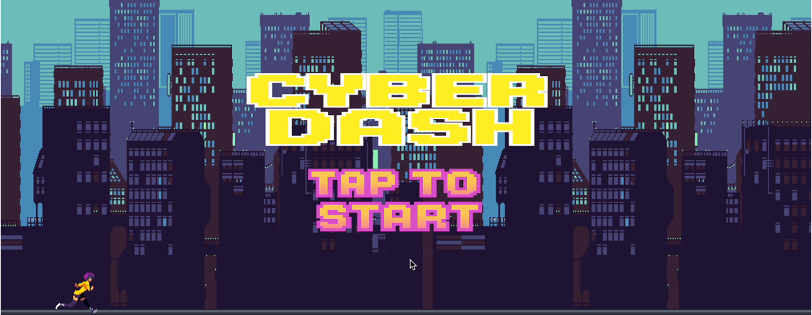

# CyberDash_SourceCode

# 스크립트 설명 페이지

본 문서에서는 프로젝트의 핵심 스크립트들이 수행하는 역할과 실행 흐름을 설명하며, 관련 소스 코드는 Scripts 디렉토리에서 확인할 수 있습니다.

---

<strong>1. GameManager.cs</strong>

[GameManager Script](Scripts/GameManager.cs)

### 목적:
게임의 전체적인 흐름을 관리하며, 게임 상태(인트로, 플레이 중, 사망)를 제어하고 점수 계산, 최고 점수 저장, 게임 속도 조절을 담당하는 클래스

### 주요 구성:
- **GameState (열거형)**: 게임 상태를 정의 (Intro, Playing, Dead).
- **싱글톤 패턴**: `Instance` 변수로 전역에서 접근 가능.
- **UI 및 오브젝트 참조**:
    - `IntroUi`, `DeadUi`
    - `EnemySpawner`, `DrinkSpawner`
    - `playerScript`
    - `scoreText`
- **주요 메서드**:
    - `CalculateScore()`
    - `SaveHighScore()`
    - `CalculateGameSpeed()`
    - `GameStart()`

### 코드의 흐름:
1. **초기화**: Intro UI 활성화, 싱글톤 인스턴스 설정
2. **게임 플레이**: `GameStart()` 호출로 상태 전환, 스폰 활성화, 점수 증가
3. **게임 오버**: 플레이어 체력 0 → 사망 처리, 최고 점수 저장, 종료 UI 표시

---

<strong>2. Player.cs</strong>

[Player Script]

### 목적:
플레이어 캐릭터의 움직임 (점프)과 충돌 (적, 음료) 처리, 무적 상태 제어

### 주요 구성:
- **속성**: `JumpForce`, `isGrounded`, `isInvincible`
- **컴포넌트**: `anime`, `rigid`, `boxCollider`
- **주요 메서드**:
    - `Update()`
    - `OnCollisionEnter2D()`
    - `OnTriggerEnter2D()`
    - `StartInvincible()`, `StopInvincible()`
    - `KillPlayer()`

### 코드의 흐름:
1. **초기화**: 컴포넌트 참조, 상태 초기화
2. **점프**: 스페이스바 입력 시 점프 처리
3. **충돌**: 적과 충돌 시 체력 감소, 음료로 회복, 황금 음료로 무적
4. **사망**: 체력 0일 경우 `KillPlayer()` 호출

---

<strong>3. AudioManager.cs</strong>

[AudioManager Script](Scripts/AudioManager.cs)

### 코드의 목적:
게임 내 효과음(SFX) 재생을 담당

### 주요 구성:
- **싱글톤 패턴**: `instance` 접근
- **사운드 설정**: `SFXSounds[]`, `SFXVolume`, `channels`
- **사운드 플레이어**: `SFXPlayers[]`, `channelIndex`
- **주요 메서드**:
    - `Init()`
    - `PlaySfx()`

### 코드의 흐름:
1. **초기화**: AudioSource 채널 생성
2. **재생**: SFX 타입에 따라 지정된 채널로 재생

---

<strong>4. BackgroundScroll.cs</strong>

[BackGroundScroll Script](Scripts/BackgroundScroll.cs)

### 코드의 목적:
배경을 좌측으로 스크롤시켜 무한 배경 효과 구현

### 주요 구성:
- `scrollSpeed`
- `meshRenderer` → 텍스처 오프셋 변경

### 코드의 흐름:
1. **초기화**: MeshRenderer 참조
2. **스크롤**: 매 프레임 텍스처 오프셋 이동

---

<strong>5. Destroyer.cs</strong>

[Destroyer Script](Scripts/Destroyer.cs)

### 코드의 목적:
왼쪽 경계를 벗어난 오브젝트 삭제 → 성능 최적화

### 주요 구성:
- 파괴 조건: `transform.position.x <= -13.0f`

### 코드의 흐름:
- 매 프레임 검사 → 경계 벗어나면 `Destroy(this.gameObject)`

---

<strong>6. Spawner.cs</strong>

[Spawner Script](Scripts/Spawner.cs)

### 코드의 목적:
적/음료를 무작위 생성하여 게임 장애물 및 회복 아이템 제공

### 주요 구성:
- `gameObjects[]`: 생성 가능한 오브젝트 목록
- `minSpawnTime`, `maxSpawnTime`: 생성 주기 범위

### 코드의 흐름:
1. **초기화**: 랜덤 시간에 `Spawn()` 호출
2. **Spawn()**: 랜덤 오브젝트 생성 → 다음 `Spawn()` 예약

---

<strong>7. Mover.cs</strong>

[Mover Script](Scripts/Mover.cs)

### 코드의 목적:
오브젝트를 일정한 속도로 좌측으로 이동 → 무한 스크롤 연출

### 주요 구성:
- `moveSpeed`: 이동 속도
- `Update()`: 이동 로직 (속도 × 게임 속도 × deltaTime)

### 코드의 흐름:
1. **초기화**: `Start()` 비어 있음
2. **이동**: 매 프레임 좌측 이동, `GameManager.Instance.CalculateGameSpeed()`로 속도 증가

---

<strong>8. Heart.cs</strong>

[Heart Script](Scripts/Heart.cs)

### 코드의 목적:
플레이어 체력을 하트 이미지로 시각적으로 표현

### 주요 구성:
- `OnHeart`, `OffHeart`: 하트 이미지
- `LiveNumber`: 하트 순서
- `spriteRenderer`: 이미지 변경 대상

### 코드의 흐름:
1. **초기화**: `spriteRenderer` 참조
2. **업데이트**: 체력 값에 따라 해당 하트 활성/비활성

---

<strong>9. EndButton.cs</strong>

[EndButton Script](Scripts/EndButton.cs)

### 코드의 목적:
게임 종료 화면에서 다시 시작 및 종료 기능 수행

### 주요 구성:
- `Restart()`:
    - `SampleScene` 재로드
    - `ButtonPlay` 사운드 재생
- `QuitGame()`:
    - 애플리케이션 종료 (빌드 환경 한정)
    - `EndClick` 사운드 재생

### 코드의 흐름:
1. **재시작**: `Restart()` → 씬 재시작
2. **종료**: `QuitGame()` → 종료 처리 (에디터에서는 작동 안 함)

